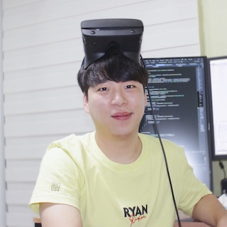

<figure>

</figure>

**팀명:** Half-Light\
**팀원:** 김현우, 박근영\
**개발 환경:** Unity 2020.1 URP, Visual Studio, GitLab\
**제작 기간:** 2020.05.01 ~ 2020.08.03 (미완성)\
**YouTube:** [Don't Push This Button Devlogs](https://www.youtube.com/watch?v=zDeuXitzKdA&list=PLqlJmp0RxHq7NrU9c2W1bA_DKvhSt7GYL)
 

# Index

**1. [<kbd> 프로젝트 소개 </kbd>](#프로젝트-소개)**
- [<kbd> 목표 </kbd>](#목표)
- [<kbd> 팀 소개 및 개발 일정 </kbd>](#팀-소개-및-개발-일정)

**2. [<kbd> 프로젝트 구현 </kbd>](#프로젝트-구현)**
- [<kbd> Animation Based Enemy </kbd>](#1-animation-based-enemy)
- [<kbd> Ragdoll Based Enemy </kbd>](#2-ragdoll-based-enemy)
- [<kbd> Patrol System </kbd>](#3-patrol-system)
- [<kbd> Navigation System </kbd>](#4-navigation-system)
- [<kbd> Interactive Environment </kbd>](#5-interactive-environment)
 

# 프로젝트 소개

<kbd>Don't Push This Button</kbd>은 **VR 전략 액션 게임**이다. 최대한 빠른 시간 안에 맵 어딘가에 위치한 **버튼**을 찾아 눌르면 스테이지를 클리어하게 된다. 난이도가 올라갈 수록 맵에 존재하는 무기의 사용 횟수가 줄어들고 적군 또한 늘어나기 때문에 제한된 자원을 현명하게 사용하는 것이 중요하다.

### 목표
첫 VR 게임을 개발하면서 몰입의 중요성을 알게 되었다. **몰입 경험**은 사용자가 마치 그 가상공간안에 들어가 있는 듯한 느낌을 주는 것으로 크게 **Sound**, **Visual**, **Interaction** 3가지 요소로 나뉠 수 있다고 생각한다. 그 중 **Interaction** 에 많은 시간을 투자하였다. PC 게임과는 다른 VR의 장점을 극대화하고 사용자 경험의 질을 높이는 데 집중했다.

### 팀 소개 및 개발 일정
##### : 팀 소개

<figure>

</figure>

|  |  |
| :김현우: | :박근영: |
| :---- | :---- |
| - Enemy | - VR Player \
| - Level Design | - Game Systems \
| - Interactive Env. | - Interactive Items \

##### : 개발 일정
@startmermaid
gantt
    dateFormat  YYYY-MM-DD
    section First Month
    주제 선정, 자료 수집    :fm1, 2020-05-03, 6d
    enemies using animation    :fm2, after fm1, 12d
    interactive level     :fm3, after fm2, 7d

    section Second Month
    active ragdoll    :sm1, 2020-06-01, 60d

    section Third Month
    patrol system    :tm1, 2020-07-01, 2d
    navigation system    :tm2, after tm1, 2d

@endmermaid

# 프로젝트 구현

## 1. Animation Based Enemy
<figure>

<figcaption>Fig 1. Animation based Enemy.</figcaption>
</figure>

처음 적을 만들 때는 애니메이션으로 움직임을 주었다. 애니메이션으로 움직이는 적은 동작 하나하나에 디테일을 살릴 수 있다는 장점이 있다. 하지만 플레이어와의 모든 인터렉션을 애니메이션으로 커버하기에는 한계가 있었다.

### a. Animation Controller

|  |  |

<figure><figcaption>Fig 2. Animation Controller.</figcaption></figure>

애니메이션 상태는 <kbd>Idle</kbd>, <kbd>Crawl</kbd>, <kbd>Attack</kbd>, <kbd>Dead</kbd> 4가지가 있다. 그 중 <kbd>Idle</kbd>과 <kbd>Crawl</kbd>는 **BlendTree**를 이용해 자연스럽게 연결했다.

### b. Structure

#### : class diagram

@startmermaid
classDiagram
    Move --|> IAction
    Combat --|> IAction
    EnemyController --> Move
    EnemyController --> Combat
    Move --> ActionScheduler
    Combat --> ActionScheduler

    <<interface>> IAction
    class IAction {
        +Cancel()
    }
    class ActionScheduler {
        -IAction currentAction
        +StartAction(IAction)
        +CancelCurrentAction()
    }
    class Move {
        +MoveAction(Vector3)
        +Cancel()
    }
    class Combat {
        +Attack(GameObject)
        +Cancel()
    }
    class EnemyController {
        -GameObject _player
        +AttackBehaviour()
        +MoveBehaviour()
    }
@endmermaid

클래스 다이어그램을 보면 적은 <kbd>Move</kbd>와 <kbd>Combat</kbd>이라는 action 클래스를 가지고 있고 둘 다 <kbd>IAction</kbd>이라는 인터페이스의 `Cancel()` 함수를 재정의한다. 재정의된 `Cancel()`은 새로운 action이 실행될 때 <kbd>ActionScheduler</kbd>가 현재 action의 `Cancel()`을 호출한다.

### c. Move

적의 이동은 **Root Motion** 과 **Navmesh Agent**를 같이 사용하였다. **Root Motion**을 사용하면 적의 움직임을 애니메이션이 제어하기 때문에 **Navmesh Agent**의 `.nextPosition`을 업데이트 해줘야 된다.

##### Move.cs


void OnAnimatorMove()
{
    Vector3 position = animator.rootPosition;
    position.y = navMeshAgent.nextPosition.y;
    transform.position = position;
}


OnAnimatorMove() 콜백함수에서 포지션 y를 업데이트한다.


void OnAnimatorMove()
private void RootMotionFollow()
{
    Vector3 worldDeltaPosition = navMeshAgent.nextPosition
        - transform.position;
    if (worldDeltaPosition.magnitude > navMeshAgent.radius)
    {
        navMeshAgent.nextPosition = transform.position
            + 0.9f * worldDeltaPosition;
    }
}


### d. Attack

적은 주먹을 날리는 애니메이션으로 플레이어를 공격한다. 플레이어가 체력이 깍이는 타이밍을 맞추기 위해 주먹을 날리는 애니메이션에 **이벤트 함수**를 심어 넣었다.

##### Combat.cs


void OnAnimatorMove()
private void TriggerAttack()
{
    /* Face the target direction */
    transform.LookAt(target.transform.position);
    /* Attack only when time since last attack
    is greater than given time. */
    if (timeSinceLastAttack > timeBetweenAtacts)
    {
        animator.ResetTrigger("cancel");
        /* This will trigger the OnAnimatorHit() event. */
        animator.SetTrigger("attack");
        timeSinceLastAttack = 0;
    }
}



void AnimationHit()
{
    if (target == null) return;
    target.TakeDamage(damage);
}


## 2. Ragdoll Based Enemy
<figure>

<figcaption>Fig 3. Ragdoll based Enemy.</figcaption>
</figure>

애니메이션을 기반으로 한 적은 물리 인터렉션이 불가능했다. VR에서는 특히 플레이어가 손을 움직이고 만질 수 있어서 애니메이션으로 미리 짜인 움직임만 하는 적은 몰입도를 떨어트렸다.

반면에 **Active Ragdoll**은 물리 인터렉션이 가능해서 플레이어가 적을 밀치거나 넘어트리는 게 가능했고 더 자연스러운 인터렉션이 몰입도를 높일 수 있었다.

### a. Structure

기본적인 **Active Ragdoll**의 상태는 4가지가 있다; <kbd>FellDown</kbd>, <kbd>OutOfBalance</kbd>, <kbd>InBalance</kbd>, <kbd>InAir</kbd>. 여기에 추가적으로 **Enemy**의 상태 4가지가 추가된다; <kbd>Dead</kbd>, <kbd>Combat</kbd>, <kbd>Guard</kbd>, <kbd>Idle</kbd>.

### b. Self Balance
<figure>

<figcaption>Fig 4. Active Ragdoll Self Balance.</figcaption>
</figure>

**YouTube Link :** [Devlog #2](https://www.youtube.com/watch?v=2zuM4VvnpB4)\
**reddit Link :** [Self Balance Prototype](https://www.reddit.com/r/Unity3D/comments/hfd3ea/active_ragdoll_self_balancing/)\
**reddit Link :** [Active Ragdoll in VR Prototype](https://www.reddit.com/r/Unity3D/comments/hk0fz0/playing_with_active_ragdoll_in_vr/)

<kbd>Self Balance</kbd>는 hip에 있는 **Configurable Joint**에 의해 많은 부분 해결된다. Joint의 Angular Drive를 강하게 하고 Z축 로테이션을 잠그면 Ragdoll은 넘어지지 않는다. 

하지만 플레이어의 재미를 위해 Ragdoll은 넘어져야 한다. 자연스럽게 넘어지려면 Ragdoll의 **Center of Mass(CoM)**이 **양발의 중심점**에서 벗어나기 시작하면 다리를 움직여 균형을 잡게 하고 많이 벗어났을때 Ragdoll의 모든 Joint의 힘을 풀어주면 넘어지게 된다.

<figure>

<figcaption>Fig 5. Active Ragdoll Gizmos.</figcaption>
</figure>

##### ActiveRagdoll.cs


private void CalculateCoM()
{
    Vector3 com = Vector3.zero; /* Center of mass */
    float sum = 0; /* Sum of mass. */

    foreach (Rigidbody rb in _rigidbodies)
    {
        com += rb.worldCenterOfMass * rb.mass;
        sum += rb.mass;
    }
    com /= sum;
    _CoM.position = com;

    Vector3 tartgetRot = Vector3.Scale(-_joints.Head.transform.forward,
        _flatUnitVec);
    _CoM.rotation = Quaternion.LookRotation(tartgetRot);
}



private void CalculateCenterPoint()
{
    Vector3[] _feetPos = new Vector3[2];
    _feetPos[0] = _joints.Foot_L.transform.position;
    _feetPos[1] = _joints.Foot_R.transform.position;

    Vector3 sum = Vector3.zero;
    if (_feetPos == null || _feetPos.Length == 0)
        _feetCenterPoint.position = sum;

    foreach (Vector3 vec in _feetPos)
        sum += vec;

    _feetCenterPoint.position = sum / _feetPos.Length;
}


CoM과 FeetCenterPoint는 매프레임 업데이트된다.


private void CalculateLeanValue()
{
    Vector3 cpFlat = Vector3.Scale(_feetCenterPoint.position, _flatUnitVec);
    Vector3 comFlat = Vector3.Scale(_CoM.position, _flatUnitVec);
    _leanDirFlat = (comFlat - cpFlat).normalized;
    _outOfBalanceValue = Vector3.Distance(comFlat, cpFlat);
}


매프레임 업데이트되는 `_CoM.position`과 `_feetCenterPoint.position`값의 Y값을 0으로 만들고 그 값으로 방향과 거리를 구한다.


private void CheckBalanceState()
{
    float dst = Mathf.Abs(_CoM.position.y - _feetCenterPoint.position.y);

    if (_CoM.position.y > _inAirThreshold)
        ragdollState = BalanceState.InAir;

    else if (dst < _fallDownThreshold)
        ragdollState = BalanceState.FellDown;

    else if (_outOfBalanceValue > _outOfBalanceThreshold)
        ragdollState = BalanceState.OutOfBalance;

    else
        ragdollState = BalanceState.InBalance;
}


Ragdoll의 기본 4가지 상태는 우선순위가 있어 그 순서대로 상태를 결정짓게 된다. `_outOfBalanceValue` 값은 설정된 `_outOfBalanceThreshold`값과 비교되고 설정된 값보다 크면 Ragdoll은 균형을 잃고 있다는 것을 의미한다.


private void CheckLeaningState()
{
    float forward = Vector3.Dot(_CoM.forward, _leanDirFlat);
    float backward = Vector3.Dot(-_CoM.forward, _leanDirFlat);
    float right = Vector3.Dot(_CoM.right, _leanDirFlat);
    float left = Vector3.Dot(-_CoM.right, _leanDirFlat);

    if (forward > _leanThreshold)
        leaningDirection = LeaningDirection.Forward;

    else if (backward > _leanThreshold)
        leaningDirection = LeaningDirection.Backward;

    else if (right > _leanThreshold)
        leaningDirection = LeaningDirection.Right;

    else if (left > _leanThreshold)
        leaningDirection = LeaningDirection.Left;

    else
        leaningDirection = LeaningDirection.NoDir;
}


넘어지는 방향은 CoM을 기준으로 한다. 넘어지는 방향은 4가지만 파악하고 **Dot Product**를 통해 그 값을 구한다.

<figure>

<figcaption>Fig 5. Active Ragdoll Gait Cycle.</figcaption>
</figure>

Ragdoll의 다리 움직임 상태는 <kbd>Swing State</kbd>, <kbd>Stance State</kbd>로 나뉜다. 활성화된 다리가 <kbd>Swing State</kbd>이다.

##### BalanceMovement.cs


#region Legs
/// 

/// 넘어지는 방향에 따라 그에 맞는 다리 움직임을 실행
/// 

public void BalanceLegMovement(LeaningDirection leaningDir)
{
    switch (leaningDir)
    {
        case LeaningDirection.Forward:
            if (!_lastActiveLeg.Equals(ActiveLeg))
            {
                _lastActiveLeg = ActiveLeg;
                _activeLegCoroutine = StartCoroutine(
                RotateLegJoints(_swing, _stance, _balanceForwardRots));
            }
            break;


다리 움직임은 이전에 활성화된 다리가 현재 활성화된 다리와 달라야지 움직인다.


private IEnumerator RotateLegJoints(Swing swing, Stance stance, LegTargetRotations tr)
{
    float startElapsedTime = 0f;

    swing.Foot.GetComponent<Collider>().material = _slide;
    stance.Foot.GetComponent<Collider>().material = _rough;

    while (startElapsedTime < tr.StartPhaseDuration)
    {
        startElapsedTime += Time.fixedDeltaTime;
        float startPhasePerc = startElapsedTime / tr.StartPhaseDuration;

        swing.Upper.targetRotation = Quaternion.Lerp(swing.Upper.targetRotation,
            tr.SwingUpStart, _startPhaseAC.Evaluate(startPhasePerc));

        swing.Lower.targetRotation = Quaternion.Lerp(swing.Lower.targetRotation,
            tr.SwingLowStart, _startPhaseAC.Evaluate(startPhasePerc));

        swing.Foot.targetRotation = Quaternion.Lerp(swing.Foot.targetRotation,
            tr.SwingFootStart, _startPhaseAC.Evaluate(startPhasePerc));

        stance.Upper.targetRotation = Quaternion.Lerp(stance.Upper.targetRotation,
            tr.StanceUpStart, _startPhaseAC.Evaluate(startPhasePerc));

        stance.Lower.targetRotation = Quaternion.Lerp(stance.Lower.targetRotation,
            tr.StanceLowStart, _startPhaseAC.Evaluate(startPhasePerc));

        stance.Foot.targetRotation = Quaternion.Lerp(stance.Foot.targetRotation,
            tr.StanceFootStart, _startPhaseAC.Evaluate(startPhasePerc));
        yield return null;
    }
    
    float endElapsedTime = 0f;
    swing.Foot.GetComponent<Collider>().material = _rough;
    stance.Foot.GetComponent<Collider>().material = _slide;

    while (endElapsedTime < tr.EndPhaseDuration)
    {
        endElapsedTime += Time.fixedDeltaTime;
        float endPhasePerc = endElapsedTime / tr.EndPhaseDuration;

        swing.Upper.targetRotation = Quaternion.Lerp(swing.Upper.targetRotation,
            tr.SwingUpEnd, _endPhaseAC.Evaluate(endPhasePerc));

        swing.Lower.targetRotation = Quaternion.Lerp(swing.Lower.targetRotation,
            tr.SwingLowEnd, _endPhaseAC.Evaluate(endPhasePerc));

        swing.Foot.targetRotation = Quaternion.Lerp(swing.Foot.targetRotation,
            tr.SwingFootEnd, _endPhaseAC.Evaluate(endPhasePerc));

        stance.Upper.targetRotation = Quaternion.Lerp(stance.Upper.targetRotation,
            tr.StanceUpEnd, _endPhaseAC.Evaluate(endPhasePerc));

        stance.Lower.targetRotation = Quaternion.Lerp(stance.Lower.targetRotation,
            tr.StanceLowEnd, _endPhaseAC.Evaluate(endPhasePerc));

        stance.Foot.targetRotation = Quaternion.Lerp(stance.Foot.targetRotation,
            tr.StanceFootEnd, _endPhaseAC.Evaluate(endPhasePerc));
        yield return null;
    }
    
    ActiveLeg = ActiveLeg.Equals(ActiveLeg.Left) ?
        ActiveLeg.Right : ActiveLeg.Left;

    SetSwingStance();
}


<kbd>Swing State</kbd>에서는 다리가 올라갔다 내려가야 하는 동작을 취해야한다. 올라가기 전 **PhysicsMaterial**을 미끄러운 값으로 바꾼다. 움직일 때 발이 걸려 넘어지는 문제를 막아준다. 다리의 움직임은 줄 때는 Joint의 **TargetRotation** 값을 타겟 값까지 Lerp한다.

Ragdoll의 다른 움직임도 마찬가지로 `.targetRotation`의 값을 바꿔주는 것으로 동작한다.

### c. Get Up
<figure>

<figcaption>Fig 6. Active Ragdoll Get Up.</figcaption>
</figure>

**YouTube Link :** [Devlog #3](https://www.youtube.com/watch?v=Yy6NPGpwW7Q)

Ragdoll은 넘어지고 다시 일어날때 Joint의 힘을 다시 강하게 하고 **AngularXZMotion**에 락을 줘서 hip의 균형을 잡는다.

### d. Attack
<figure>

</figure>

|  |  |

<figure><figcaption>Fig 7. Active Ragdoll Attacks.</figcaption></figure>

**YouTube Link :** [Devlog #4](https://www.youtube.com/watch?v=Qa51O93OS5w)

무기를 이용한 공격 클래스는 **ICombat**의 `Attack()` 함수를 재정의한다. 

공격 움직임도 준비 자세와 공격 자세로 나뉜다. 준비 자세에서 목표물까지의 방향을 구하고 공격하게 된다.

### e. Look At

<figure>

<figcaption>Fig 8. View Angle.</figcaption>
</figure>

Ragdoll은 **View Angle**이 있다. 플레이어가 시야에 들어와야지만 플레이어를 쫓기 시작한다.

##### ActiveRagdoll.cs


private bool PlayerInViewAngle()
{
    float cosAngle = Vector3.Dot(headToTargetDir,
        setup.cJoints.Head.transform.forward);
    float angle = Mathf.Acos(cosAngle) * Mathf.Rad2Deg;

    return angle < AngleCutOff;
}


Dot Product를 이용해 머리의 forward와 타겟을 바라보는 방향의 각도를 구한다. 그 값을 이용해 시야의 범위를 정한다.

### f. Interactions

<figure>

<figcaption>Fig 9. Push.</figcaption>
</figure>

<figure>

<figcaption>Fig 10. Touch.</figcaption>
</figure>

<figure>

<figcaption>Fig 11. Home Run.</figcaption>
</figure>

<figure>

<figcaption>Fig 12. Explosion.</figcaption>
</figure>

<figure>

<figcaption>Fig 13. Gun Shot.</figcaption>
</figure>

<figure>

<figcaption>Fig 14. Overload.</figcaption>
</figure>

## 3. Patrol System

point를 이용한 간단한 **Patrol System**이다. 빈오브젝트로 point를 배치하고 인스펙터에서 모드를 선택할 수 있다.

### a. Linear

##### PathController.cs


if (SelectedPath.Equals(PathType.Linear))
{
    for (int i = 0; i < transform.childCount; i++)
    {
        if (i == transform.childCount - 1)
        {
            Gizmos.DrawSphere(GetGuardPoint(i), 0.1f);
            break;
        }
        Gizmos.DrawSphere(GetGuardPoint(i), 0.1f);
        Gizmos.DrawLine(GetGuardPoint(i), GetGuardPoint(i + 1));
    }
}



public int GetNextLinearIndex(int i)
{
    if (i + 1 == transform.childCount) { linearIndexAdder = -1; }
    if (i == 0) { linearIndexAdder = 1; }
    return i + linearIndexAdder;
}


### b. Loop

##### PathController.cs


Gizmos.color = Color.cyan;
if (SelectedPath.Equals(PathType.Loop))
{
    for (int i = 0; i < transform.childCount; i++)
    {
        int j = GetNextLoopIndex(i);
        Gizmos.DrawSphere(GetGuardPoint(i), 0.1f);
        Gizmos.DrawLine(GetGuardPoint(i), GetGuardPoint(j));
    }
}



public int GetNextLoopIndex(int i)
{
    if (i + 1 == transform.childCount) { return 0; }
    return i + 1;
}


## 4. Navigation System

### a. Agent

Ragdoll에 **Navmesh Agent**를 직접 적용할 수 없으므로 Ragdoll이 Agent를 따라가고 Agent가 타겟을 따라가게 한다. 이때 Agent는 일정 거리까지만 움직이게 속도를 제한한다. 

##### PathController.cs


private void MoveAgent(Vector3 destination)
{
    navMeshAgent.destination = destination;
    navMeshAgent.isStopped = false;

    var dst = (navMeshAgent.transform.position
        - ragdoll.CoM.transform.position).sqrMagnitude;
    navMeshAgent.speed = ((maxDistance - dst) / maxDistance) * maxSpeed;
}


## 5. Interactive Environment

<figure>

<figcaption>Fig 15. Dungeon.</figcaption>
</figure>

### a. Gate

<figure>

<figcaption>Fig 16. Gate.</figcaption>
</figure>

### b. Coffin

<figure>

<figcaption>Fig 17. Coffin.</figcaption>
</figure>

### c. Bridge

<figure>

<figcaption>Fig 18. Bridge.</figcaption>
</figure>